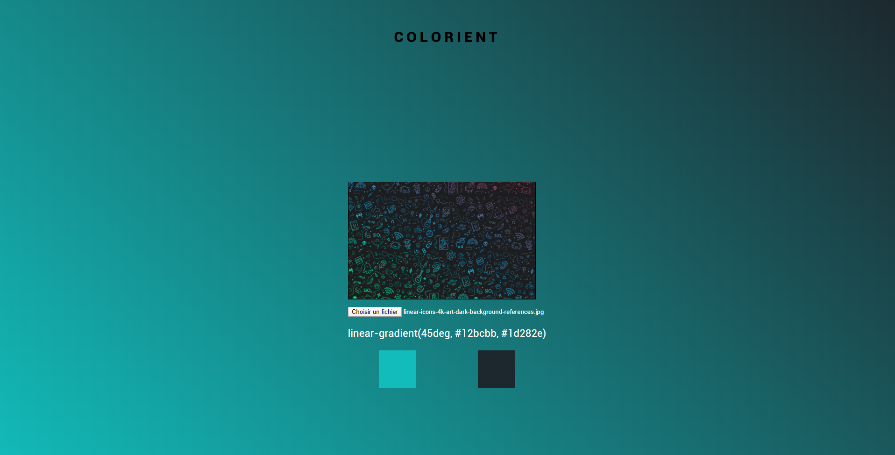

# Color-average

## Project Description:

Color-average is a project I wanted to do for a long time, so basicaly I upload an image and then get the average color of it

## How to use it?

Just follow this [link](https://atndesign.github.io/color-average/index.html) .

## Techologies:

#### Languages

- HTML
- CSS
- JS

## Screenshots

